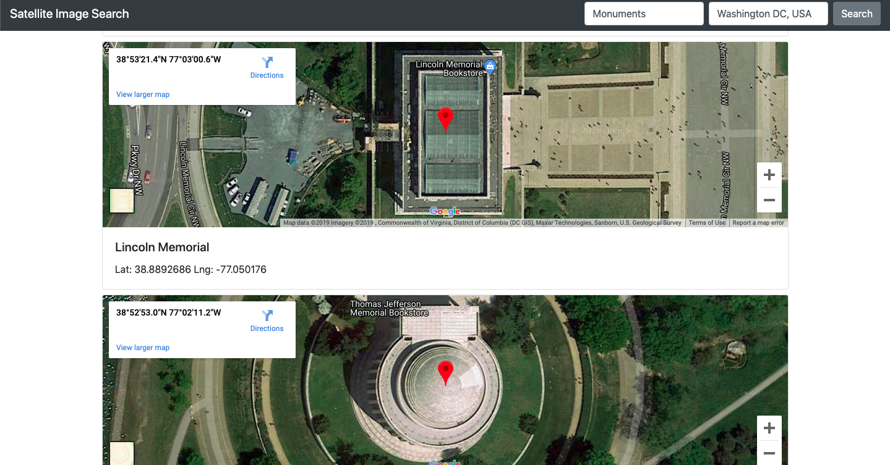

# Satellite Image Search Tool

This tool shows satellite images based on a search term and a certain location.

For example, you could search for **Monuments** located on **Washington, D.C.** and the tool will display all the monuments found within a 10 Km radius.



## Requirements

- flask
- flask-bootstrap
- googlemaps
- easydict

## Usage

This tool is Flask based, therefore you need to run the server as:
```
python3 -u app.py --ip=<server_ip> --port=<server_port>
```

by default the server_ip is *0.0.0.0* and the port is set to *5000*.

Then access the service via the browser of your preference:

```
http://localhost:5000/search
```
